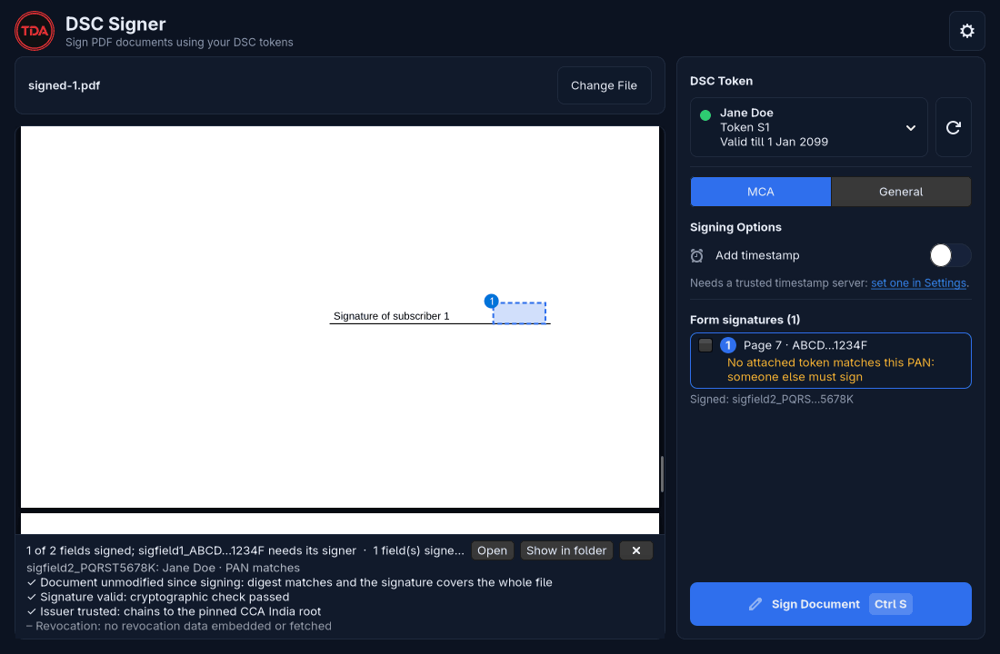
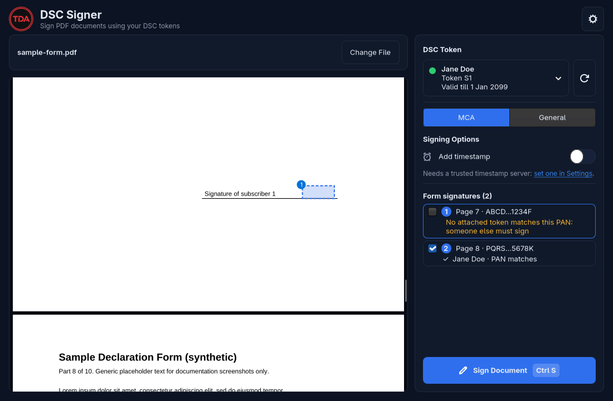
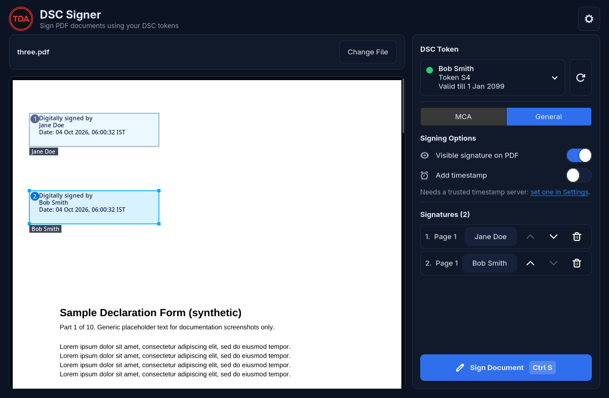
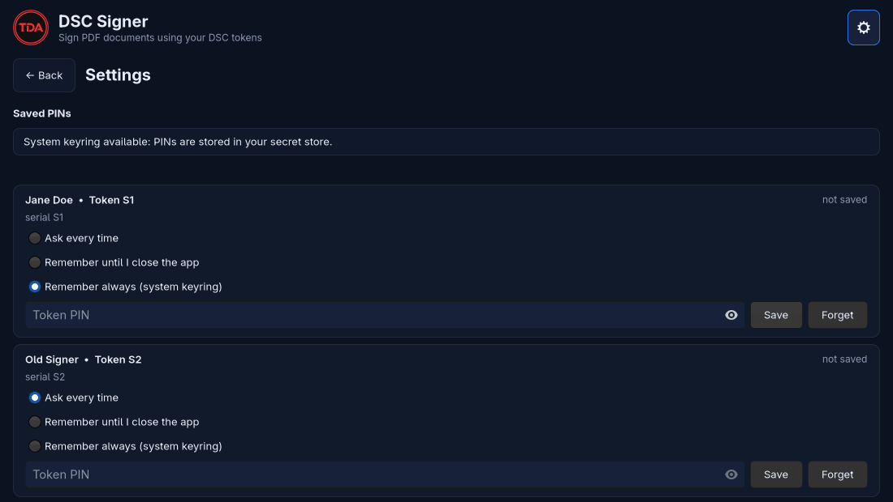
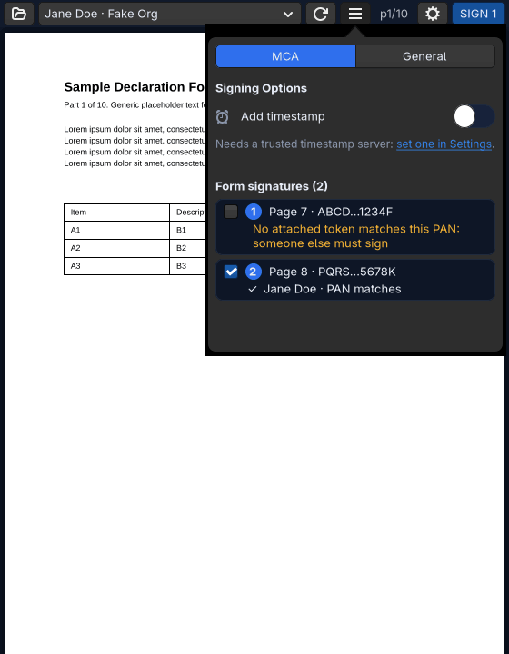

# DSC Signer

**A DSC signer for Linux: sign PDF files with your Indian DSC USB token (Class 3 DSC) from a native GTK4 window or the command line, over PKCS#11.**

Sign a PDF with a DSC USB token on Linux without Windows, Java or a browser plugin. Built for Indian Digital Signature
Certificates (DSC) used for **MCA forms** and general PDF signing. Packaged for **Arch Linux (AUR)**; runs on any distro
that provides GTK4 and a vendor PKCS#11 driver for your token.

## Features

- **Sign a PDF with a DSC USB token**: pick the signer, draw a signature box on any page, enter the PIN, save. Several boxes
  with different signers in one run.
- **MCA mode**: opens an MCA-style form, finds its empty `sigfield<N>_<PAN>` signature fields and matches each to the attached
  token whose certificate carries `sha256(PAN)`. You sign only the fields your token may sign; the rest stay empty for the
  next director.
- **General mode**: free-placed visible or invisible PAdES signatures on any PDF.
- **PKCS#11 via a separate process**: the vendor driver is loaded in its own module-host subprocess, never in the GUI.
- **PIN care**: never stored by default, one login per signing action, wrong-PIN memory protects the token's retry counter.
  Optional saved PIN in the system keyring. See [SECURITY.md](SECURITY.md).
- **Verification after signing**: unmodified, signature valid, issuer trusted (pinned CCA India 2022 root), revocation
  (reported as unchecked).
- **GUI and CLI**: `tda-dsc-signer` (alias `dsc-sign`), a `doctor` command for pcscd/USB/driver problems, adaptive layout down to a narrow strip.

| MCA mode | General mode |
| --- | --- |
|  |  |
| **Settings** | **Narrow layout** |
|  |  |

Screenshots use fake tokens, synthetic names (Jane Doe, Bob Smith) and synthetic PANs.

## Supported tokens

| Token | Status |
| --- | --- |
| InnaIT / Precision Biometric | **Verified on real hardware** |
| ePass2003, WatchData, SafeNet, GTOP11 and others | **Untested.** Probed through the vendor PKCS#11 driver that *you* install; may or may not work. Please open a "token support" issue with your result. |

This tool does **not** bundle any vendor driver. Install your token vendor's PKCS#11 library yourself (for InnaIT:
`libInnaITPKCS11Driver.so`). Modules registered with p11-kit, known vendor paths, `DSC_MODULES` and `extra_modules` in the
config are scanned; OpenSC is a fallback only.

## Install

Requires Python 3.12+, GTK4, poppler-glib, PyGObject, `pcsclite` and `ccid` for the reader, plus your token's driver.

**Arch Linux (AUR)**, once published:

    yay -S tda-dsc-signer

**From source** (any distro with the system dependencies; the venv must see the system `gi`):

    git clone https://github.com/TheDarkArtist/tda-dsc-signer && cd tda-dsc-signer
    make install        # venv under ~/.local/share/tda-dsc-signer, command in ~/.local/bin, desktop entry, icon
    make uninstall      # remove it again

Dependencies are installed exactly as locked in `uv.lock`; update by pulling and running `make install` again.

## Quick start

    tda-dsc-signer                        # GUI
    tda-dsc-signer form.pdf               # GUI with the file open
    tda-dsc-signer list                   # signing certificates on attached tokens (no PIN)
    tda-dsc-signer doctor                 # diagnose pcscd / USB / driver; prints the fixes, never runs sudo
    tda-dsc-signer sign in.pdf -p 1 -b 50,50,300,120          # visible box, page 1, PDF points from bottom-left
    tda-dsc-signer sign in.pdf --invisible -o out.pdf
    tda-dsc-signer fields FORM.pdf                            # fields, masked PANs, which attached token matches
    tda-dsc-signer sign FORM.pdf --all-fields                 # every field your attached tokens match

`sign` refuses to overwrite an existing output (`--force`) and never touches the input. Exit code 2 means the post-sign
verification failed. The PIN is requested interactively; `--pin-fd N` reads it from a descriptor. Full flags:
`tda-dsc-signer sign --help` and the man page.

## MCA workflow in 5 steps

1. Plug in your DSC token and open the MCA form PDF (`tda-dsc-signer form.pdf`). MCA mode is chosen automatically when the form has empty signature fields.
2. The right panel lists each field with its page and masked PAN. Fields your token can sign are ticked; others read "No attached token matches this PAN: someone else must sign".
3. Press **Sign** (Ctrl+S), enter the token PIN once per token, choose where to save.
4. Send the saved PDF to the next signer; repeat for their fields. Outputs chain: each run starts from the previous file.
5. Check the verification rows shown after signing.

Whether the MCA portal accepts the result is **not verified** (see below).

## How PINs are protected

The PIN is never written to disk, logs, the command line or the config file. It lives in memory for one signing action and
travels to the driver process over a pipe. Exactly one login is made per signing action and never retried; after a wrong PIN the
next attempt within five minutes needs explicit confirmation, and locked tokens or a final try are refused. Saving a PIN is
opt-in per token (memory for the session, or the system keyring); there is no plaintext fallback. Threat model and residual
risks: [SECURITY.md](SECURITY.md).

## What is verified and what is not

| Verified | Not verified |
| --- | --- |
| Signing and verification with an InnaIT token on real hardware | **MCA portal acceptance** and which signature format it expects (`--format adbe\|pades`, default adbe for fields) |
| End-to-end PKCS#11 signing against SoftHSM and a fake-token GUI harness in the test suite | Any token other than InnaIT |
| Keyring storage: tested with fakes and once with a real gnome-keyring | Adobe Acrobat trust display (it uses its own trust list) |
| Pinned CCA India 2022 trust bundle: hashes checked in code and tests | Revocation: never checked (nothing is embedded or fetched) |

## Troubleshooting

- **"No tokens found" although the token is plugged in, or flapping results.** Vendor drivers and PC/SC readers cannot be shared:
  another program holding the driver (Seahorse, a second DSC Signer, OpenSC tools, a browser's smart-card module) breaks the scan.
  Close it, then refresh. `tda-dsc-signer doctor` names a busy driver and its process.
- **"Token driver is in use by another tda-dsc-signer".** Close the other instance, or pass `--wait-driver SECONDS`.
- **Saved PIN unavailable.** The keyring option needs a running Secret Service (gnome-keyring or KeePassXC with Secret Service
  integration) that is unlocked. Settings shows its status; without one, "Remember always" is refused.
- **The app does not start from the launcher (rofi, dmenu, i3).** The session `PATH` often lacks `~/.local/bin`. `make install`
  writes the absolute path into the desktop entry; re-run it after moving the prefix, and see `tda-dsc-signer doctor`.
- **More detail:** `DSC_DEBUG=1 tda-dsc-signer` prints one line per signing step (never a PIN).

## Documentation

- [CLI reference](docs/cli-reference.md): every command, flag, exit code, config key and environment variable.
- [Architecture](docs/architecture.md): module host, PIN flow, signing pipeline, trust, GUI structure, testing.
- [Project site](https://thedarkartist.github.io/tda-dsc-signer/)

## Contributing and releasing

See [CONTRIBUTING.md](CONTRIBUTING.md) (dev setup, tests, privacy rule) and [RELEASING.md](RELEASING.md). Changes are listed in
[CHANGELOG.md](CHANGELOG.md). Report vulnerabilities privately as described in [SECURITY.md](SECURITY.md).

## License

GPL-3.0-or-later, see [LICENSE](LICENSE). The bundled CA certificates are public data from cca.gov.in. The **TDACorp logo is a brand
mark and is not covered by the GPL.**

DSC Signer is independent software. It is **not affiliated with or endorsed by the Ministry of Corporate Affairs (MCA), the
Controller of Certifying Authorities (CCA) or any certifying authority**. You are responsible for checking that a signed file
meets the requirements of whoever receives it.
